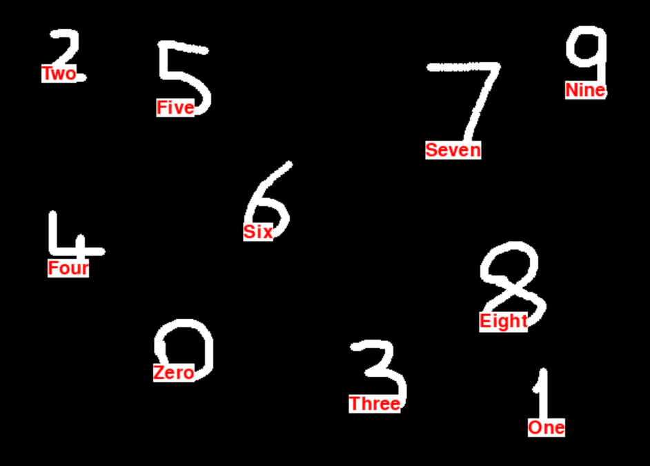

# Handwritten Digit Recognition

This project is a deep learning-based solution for recognizing handwritten digits using the MNIST dataset. It includes both the training of a Convolutional Neural Network (CNN) and an interactive Python application that allows users to draw digits and see predictions in real-time.

## Features

1. **Model Training:**
   - Utilizes TensorFlow/Keras for training a CNN on the MNIST dataset.
   - Implements dropout layers to prevent overfitting.
   - Includes early stopping and model checkpointing for efficient training.

2. **Real-Time Prediction Application:**
   - Built using Pygame to provide a digit-drawing interface.
   - Predicts the digit drawn by the user and displays the result.

<p align="left">
  
</p>

## Installation

### Prerequisites

Ensure you have the following installed on your system:

- Python (>= 3.7)
- TensorFlow (>= 2.0)
- Keras
- OpenCV
- NumPy
- Matplotlib
- Pygame

### Steps

1. Clone the repository:
   ```bash
   git clone https://github.com/<your-username>/Handwritten-Digit-Recognition.git
   cd Handwritten-Digit-Recognition
   ```
2. Install the required dependencies:
   ```bash
   pip install -r requirements.txt
   ```
3. Train the model (optional, as a pre-trained model is included):
   ```bash
   python train_model.py
   ```
4. Run the application:
   ```bash
   python app.py
   ```
## Usage

### Training the Model

1. Load the MNIST dataset.
2. Preprocess the data by normalizing pixel values and one-hot encoding the labels.
3. Train the CNN model using the following architecture:
   - Convolutional layers
   - MaxPooling layers
   - Dropout layer for regularization
   - Dense output layer with a softmax activation function

### Running the Application

1. Launch `app.py` to open a drawing window.
2. Use the mouse to draw a digit in the window.
3. Release the mouse button to see the predicted digit displayed in real-time.

## Results

- The model achieves over 98% accuracy on the MNIST test set.
- The real-time application predicts user-drawn digits with high accuracy.


